### [navigation](https://reactnavigation.org/docs/getting-started)

---

## 1. Chuyển đổi giữa các màn hình

Một ứng dụng bạn phát triển không thể chỉ có một màn hình. Vì vậy bạn phải biết cách chuyển đổi qua lại giữa các màn hình. Hiện tại mình sử dụng thư viện react-navigation (v.2.18.1) để chuyển đổi giữa các màn hình. Các bạn có thể tìm hiểu thêm về thư viện này tại (<https://reactnavigation.org>)

- Cài đặt thư viện:
  Vào dự án bạn tạo và chạy dòng lệnh sau để cài đặt thư viện
  `npm install --save @react-navigation/native @react-navigation/stack @react-navigation/material-top-tabs`
  đây là 3 gói dùng để điều hướng các màn hình trong ứng dụng

- Sử dụng thư viện:

**- Xây dựng cấu trúc ứng dụng**: Để bạn hiểu rõ hơn về phần demo sau bạn vui lòng xem lại file index.js trong Example (./src/navigator/index.js). Dưới đây là phần tạo cấu trúc sườn của ứng dụng dựa vào StackNavigator của thư viện react-navigation.

@react-navigation/native: gói mặc định bắt buộc phải có để tạo khối ngoài cùng bao lại tất cả các màn hình đã khai báo

```
npm install react-native-reanimated react-native-gesture-handler react-native-screens react-native-safe-area-context @react-native-community/masked-view
```

đây là các thư viện dependencies( phụ thuộc ) cần phải cài để chạy được navigation

```javascript
example: import * as React from 'react';
import {View, Text} from 'react-native';
import {NavigationContainer} from '@react-navigation/native';
import {createStackNavigator} from '@react-navigation/stack';

function HomeScreen() {
  return (
    <View style={{flex: 1, alignItems: 'center', justifyContent: 'center'}}>
      <Text>Home Screen</Text>
    </View>
  );
}

function DetailsScreen() {
  return (
    <View style={{flex: 1, alignItems: 'center', justifyContent: 'center'}}>
      <Text>Details Screen</Text>
    </View>
  );
}

const Stack = createStackNavigator();

function App() {
  return (
    <NavigationContainer>
      <Stack.Navigator>
        <Stack.Screen name="Home" component={HomeScreen} />
        <Stack.Screen name="Details" component={DetailsScreen} />
      </Stack.Navigator>
    </NavigationContainer>
  );
}
```

@react-navigation/stack
dùng để tạo ra một stack để lưu trữ các màn hình đã được đi qua giống như một array
ví dụ: khi mới khai báo ta có
stack = [] khi đi qua màn hình a stack = [“screen a”] nhờ đó ta lưu được vị trí các màn đã qua để có thể back lại hoặc nhảy tới một màn bất kỳ

**- Chuyển đổi màn hình**: có 2 cách chuyển màn hình:

- Chuyển đổi và xóa toàn bộ màn hình trước đó:

  ```
  // chuyển qua màn hình PROPS đã khai báo trong App StackNavigator
  let pageContinue = NavigationActions.reset({
  	index: 0,
  	actions: [NavigationActions.navigate({ routeName: "Home", params: {} })]
  });
  this.props.navigation.dispatch(pageContinue);
  ```

  params: {} - Đây là phần để bạn truyền dữ liệu qua màn hình kế tiếp. Bạn có thể truyền qua cho màn hình tiếp theo một đối tượng theo cú pháp này.

- Chuyển đổi và giữ lại màn hình trước để quay lại

  ```
  // chuyển qua màn hình PROPS đã khai báo trong App StackNavigator
  this.props.navigation.navigate("Home");
  //or
  this.props.navigation.navigate("Home", {});
  ```

  {} - Đây cũng là cách để bạn truyền một đối tượng qua cho màn hình kế tiếp.<br>Mặc định nếu bạn hiển thị Status bar thì sẽ có phím quay về, nhưng nếu cần thiết có thể quay về bằng cách gọi hàm sau đây:
  `this.props.navigation.goBack();`

  Hiển thị Status bar:

  ```
  static navigationOptions = ({ navigation }) => {
  	return {
      	title: "Home",
      	headerStyle: {
          	backgroundColor: Colors.primary
      	},
      	headerTintColor: Colors.white,
      	headerTitleStyle: {
          	alignSelf: 'center'
      	}
  	};
  };
  ```

  [document source - tham khảo thêm các trường hợp khác](https://reactnavigation.org/docs/getting-started)

# [2.react-native-tab-view](https://github.com/satya164/react-native-tab-view)

---

Tab view giúp việc chuyển đổi giữa các tab trên cùng một màn hình trở nên mượt hơn.
Cài đặt:

```
npm i react-native-tab-view or yarn add react-native-tab-view
```

Từ React Native 0.60 trở lên mọi liên kết đều là tự động nên ta không cần chạy `react-native link`

<a href="https://raw.githubusercontent.com/satya164/react-native-tab-view/master/demo/demo.mp4"></a>

Example:

```javascript
import * as React from 'react';
import {View, StyleSheet, Dimensions} from 'react-native';
import {TabView, SceneMap} from 'react-native-tab-view';

const FirstRoute = () => (
  <View style={[styles.scene, {backgroundColor: '#ff4081'}]} />
);

const SecondRoute = () => (
  <View style={[styles.scene, {backgroundColor: '#673ab7'}]} />
);

const initialLayout = {width: Dimensions.get('window').width};

export default function TabViewExample() {
  const [index, setIndex] = React.useState(0);
  const [routes] = React.useState([
    {key: 'first', title: 'First'},
    {key: 'second', title: 'Second'},
  ]);

  const renderScene = SceneMap({
    first: FirstRoute,
    second: SecondRoute,
  });

  return (
    <TabView
      navigationState={{index, routes}}
      renderScene={renderScene}
      onIndexChange={setIndex}
      initialLayout={initialLayout}
    />
  );
}

const styles = StyleSheet.create({
  scene: {
    flex: 1,
  },
});
```

Tab View: là nơi hiển thị và quản lí components

**_Props:_**
navigationState (required): Trạng thái chế độ xem tab, gồm 2 thuộc tính sau:

- index: 1 số đại diện cho chỉ số của tuyến hoạt động trong routes mảng
- routes: một mảng chứa danh sách các đối tượng được sử dụng để hiển thị các tab
  Mỗi đối tượng routes phải chứa các thuộc tính sau:
  - key: 1 khóa duy nhất để xác định route (bắt buộc)
  - title: tiêu đề
  - icon: biểu tượng hiển thị trong tab

Example:

```javascript
{
  index: 1,
  routes: [
    { key: 'music', title: 'Music' },
    { key: 'albums', title: 'Albums' },
    { key: 'recents', title: 'Recents' },
    { key: 'purchased', title: 'Purchased' },
  ]
}
```

**_onIndexChange( required)_**
Gọi lại được gọi khi thay đổi tab, nhận chỉ mục của tab mới làm đối số. Trạng thái điều hướng được cập nhật lại khi nó được gọi.<br />

**_renderScene( required)_**
Gọi lại và trả về một phần tử để hiển thị cho tab. Nhận một đối tượng chứa routes làm đối số:

Example:

```javascript
const renderScene = ({route, jumpTo}) => {
  switch (route.key) {
    case 'music':
      return <MusicRoute jumpTo={jumpTo} />;
    case 'albums':
      return <AlbumsRoute jumpTo={jumpTo} />;
  }
};
```

Để chỉ định các thành phần dễ dàng hơn, bạn có thể sử dụng `SceneMap`

`SceneMap` nhận một đối tượng với ánh xạ của các `route.key` thành phần React và trả về một hàm để sử dụng với `renderSceneprop`.

Example:

```javascript
import { SceneMap } from 'react-native-tab-view';

...

const renderScene = SceneMap({
  music: MusicRoute,
  albums: AlbumsRoute,
});
```

**_renderTabBar_**
Gọi và trả về một Phần tử React tùy chỉnh để sử dụng làm thanh tab:

```javascript
import { TabBar } from 'react-native-tab-view';

...

<TabView
  renderTabBar={props => <TabBar {...props} />}
  ...
/>
```

Nếu điều này không được chỉ định, thanh tab mặc định sẽ được hiển thị. Có thể tùy chỉnh hoặc tắt thanh tab bằng cấu trúc này:

```javascript
<TabView
  renderTabBar={() => null}
  ...
/>
```

**_tabBarPosition_**
Vị trí của thanh `tab`. Giá trị có thể là `'top'` và `'bottom'`. Mặc định là `'top'`.

**_initialLayout_**
Đối tượng chứa chiều cao và chiều rộng ban đầu của màn hình. Đối với hầu hết các ứng dụng, đây là một mặc định tốt:

```javascript
<TabView
  initialLayout={{ width: Dimensions.get('window').width }}
  ...
/>
```

**_TabBar:_**
design thanh `tab`, để custom tab bạn cần sử dụng `renderTabBar`
Ví dụ : để tùy chỉnh màu indicator color và background bạn có thể dùng `indicatorStyle` và `style`

```javascript
const renderTabBar = props => (
  <TabBar
    {...props}
    indicatorStyle={{ backgroundColor: 'white' }}
    style={{ backgroundColor: 'pink' }}
  />
);

//...


return (
  <TabView
    renderTabBar={renderTabBar}
    ...
  />
);
```

[Đây là một số các thuộc tính hay dùng, để xem chi tiết truy cập vào https://github.com/satya164/react-native-tab-view](https://github.com/satya164/react-native-tab-view)

[github: https://github.com/react-native-community/async-storage](https://github.com/react-native-community/async-storage)

# [React native Action Sheet](https://github.com/ammarahm-ed/react-native-actions-sheet)

---


Cài đặt :

```javascript
npm install react-native-actions-sheet --save
```

hoặc lệnh `yarn`

```javascript
yarn add react-native-actions-sheet
```

Example:

```javascript
import ActionSheet from 'react-native-actions-sheet';
import React, {createRef} from 'react';

const actionSheetRef = createRef();

const App = () => {
  let actionSheet;

  return (
    <View
      style={{
        justifyContent: 'center',
        flex: 1,
      }}>
      <TouchableOpacity
        onPress={() => {
          actionSheetRef.current?.setModalVisible();
        }}>
        <Text>Open ActionSheet</Text>
      </TouchableOpacity>

      <ActionSheet ref={actionSheetRef}>
        <View>
          <Text>YOUR CUSTOM COMPONENT INSIDE THE ACTIONSHEET</Text>
        </View>
      </ActionSheet>
    </View>
  );
};

export default App;
```

**_Props:_**

- `ref:` Gán một tham chiếu cho thành phần `ActionSheet` để sử dụng các phương thức.

- `initialOffsetFromBottom:` Sử dụng nếu bạn muốn hiển thị một phần ActionSheet khi mở. Đòi hỏi `gestureEnabled=true`
- `containerStyle:` style cho action sheet
- `delayActionSheetDraw:` Trì hoãn mở action sheet của Android. Default: False
- `delayActionSheetDrawTime:` Trì hoãn thời gian mở của Android. Default:50 mili giây
- `CustomHeaderComponent:` Tùy chỉnh header
- `animated:` Tạo hiệu ứng cho việc đóng mở. Default:true
- `gestureEnabled:` cho phép điều khiển bằng cử chỉ(vuốt lên xuống). Default: false
- `closeOnTouchBackdrop:` Kiểm soát việc đóng ActionSheet bằng cách chạm vào phông nền. Default: true
- `bounceOnOpen:` Tạo hiệu ứng nảy lên khi mở. Default: false
- `overlayColor:` màu của lớp phủ/ phông nền. default:’black’
- `defaultOverlayOpacity:`độ mờ của lớp phủ/phông nền. Default:0.3

## 3. Lưu trữ dữ liệu

React-Native mặc định hỗ trợ chức năng lưu trữ thông qua AsyncStorage được cung cấp mặc định trong gói thư viện react-native. Xem phần Storage phía dưới để tìm hiểu thêm về phương pháp lưu trữ này.

# [AsyncStorage - document](https://react-native-community.github.io/async-storage/docs/api)

---

### 3.1. AsyncStorage:

Bởi vì AsyncStorage chạy bất đồng bộ vì vậy mình chỉ sử dụng AsyncStorage để lưu một số config của ứng dụng ví dụ như user data hay language code ..., những dữ liệu quan trọng và có cấu trúc thường mình sẽ sử dụng database để lưu trữ, truy xuất nhanh và dễ dàng hơn.

import thư viện AsyncStorage:

```javascript
import {AsyncStorage} from 'react-native';
```

### setItem / getItem

lấy giá trị theo cặp giá trị key - value.khi ta muốn lấy giá trị value thì ta dùng key tương ứng:

Example:

```javascript
// lưu trữ dữ liệu theo dạng key -> value (nếu value là một đối tượng thì nên chuyển đổi về JSON trước sử dụng JSON.stringify(obj))
AsyncStorage.setItem('language', 'vi'); // --> cài đặt value là vi cho key language

getLanguage = async () => {
  try {
    //Đọc giá trị lên và sử dụng.
    return await AsyncStorage.getItem('language').then((result) => {
      console.log(result); //in ra màn hình console: vi ---> trả về giá trị với key là language
    });
  } catch (e) {
    // read error
  }

  console.log('Done.');
};
```

### mergeItem

là việc nghi đè nên value của một key đã tồn tại.

Example:

```javascript
const USER_1 = {
  name: 'Tom',
  age: 20,
  traits: {
    hair: 'black',
    eyes: 'blue',
  },
};

const USER_2 = {
  name: 'Sarah',
  age: 21,
  hobby: 'cars',
  traits: {
    eyes: 'green',
  },
};

mergeUsers = async () => {
  try {
    //save first user
    await AsyncStorage.setItem('@MyApp_user', JSON.stringify(USER_1));

    // merge USER_2 into saved USER_1
    await AsyncStorage.mergeItem('@MyApp_user', JSON.stringify(USER_2));

    // read merged item
    const currentUser = await AsyncStorage.getItem('@MyApp_user');

    console.log(currentUser);

    // console.log result:
    // {
    //   name: 'Sarah',
    //   age: 21,
    //   traits: {
    //     eyes: 'green',
    //     hair: 'black'
    //   }
    // }
  }
};
```

### removeItem

Xóa đi một key đã tồn tại( kèm theo value của nó).

Example:

```javascript
removeValue = async () => {
  try {
    await AsyncStorage.removeItem('@MyApp_key');
  } catch (e) {
    // remove error
  }

  console.log('Done.');
};
```

### getAllKeys

lấy tất cả các key đã có trong storage.

Example:

```javascript
getAllKeys = async () => {
  let keys = [];
  try {
    keys = await AsyncStorage.getAllKeys();
  } catch (e) {
    // read key error
  }

  console.log(keys);
  // example console.log result:
  // ['@MyApp_user', '@MyApp_key']
};
```

### multiGet

lấy nhiều giá trị trong storage cùng một lúc

Example:

```javascript
getMultiple = async () => {
  let values;
  try {
    values = await AsyncStorage.multiGet(['@MyApp_user', '@MyApp_key']);
  } catch (e) {
    // read error
  }
  console.log(values);

  // example console.log output:
  // [ ['@MyApp_user', 'myUserValue'], ['@MyApp_key', 'myKeyValue'] ]
};
```

### multiSet

xét nhiều giá trị cùng với key của nó cùng lú khi đó đầu vào sẽ là một mảng các cặp key value tương ứng

Example:

```javascript
multiSet = async () => {
  const firstPair = ['@MyApp_user', 'value_1'];
  const secondPair = ['@MyApp_key', 'value_2'];
  try {
    await AsyncStorage.multiSet([firstPair, secondPair]);
  } catch (e) {
    //save error
  }

  console.log('Done.');
};
```

### multiMerge

nghi đè nên nhiều giá trị cùng lúc.

Example:

```javascript
const USER_1 = {
  name: 'Tom',
  age: 30,
  traits: {hair: 'brown'},
};

const USER_1_DELTA = {
  age: 31,
  traits: {eyes: 'blue'},
};

const USER_2 = {
  name: 'Sarah',
  age: 25,
  traits: {hair: 'black'},
};

const USER_2_DELTA = {
  age: 26,
  traits: {hair: 'green'},
};

const multiSet = [
  ['@MyApp_USER_1', JSON.stringify(USER_1)],
  ['@MyApp_USER_2', JSON.stringify(USER_2)],
];

const multiMerge = [
  ['@MyApp_USER_1', JSON.stringify(USER_1_DELTA)],
  ['@MyApp_USER_2', JSON.stringify(USER_2_DELTA)],
];

mergeMultiple = async () => {
  let currentlyMerged;

  try {
    await AsyncStorage.multiSet(multiSet);
    await AsyncStorage.multiMerge(multiMerge);
    currentlyMerged = await AsyncStorage.multiGet([
      '@MyApp_USER_1',
      '@MyApp_USER_2',
    ]);
  } catch (e) {
    // error
  }

  console.log(currentlyMerged);
  // console.log output:
  // [
  // [
  // 'USER_1',
  // {
  // name:"Tom",
  // age:30,
  // traits: {
  // hair: 'brown'
  // eyes: 'blue'
  // }
  // }
  // ],
  // [
  // 'USER_2',
  // {
  // name:'Sarah',
  // age:26,
  // traits: {
  // hair: 'green'
  // }
  // }
  // ]
  // ]
};
```

### multiRemove

xóa nhiều giá trị cùng lúc.

Example:

```javascript
removeFew = async () => {
  const keys = ['@MyApp_USER_1', '@MyApp_USER_2'];
  try {
    await AsyncStorage.multiRemove(keys);
  } catch (e) {
    // remove error
  }

  console.log('Done');
};
```

### clear

xóa tất cả storage đang lưu.

Example:

```javascript
clearAll = async () => {
  try {
    await AsyncStorage.clear();
  } catch (e) {
    // clear error
  }

  console.log('Done.');
};
```

### useAsyncStorage

giúp thực hiện nhiều lệnh trong storage cùng một lúc và nên dùng trong hook.

ví dụ: ta có thể vừa lấy giá trị xong set cho giá trị khác lại nghi đè và xóa đi cùng trong một câu lệnh

```javascript
static useAsyncStorage(key: string): {
getItem: (
callback?: ?(error: ?Error, result: string | null) => void,
) => Promise<string | null>,
setItem: (
value: string,
callback?: ?(error: ?Error) => void,
) => Promise<null>,
mergeItem: (
value: string,
callback?: ?(error: ?Error) => void,
) => Promise<null>,
removeItem: (callback?: ?(error: ?Error) => void) => Promise<null>,
}
```

Example:

```javascript
mport React, { useState, useEffect } from 'react';
import { View, Text, TouchableOpacity } from 'react-native';
import { useAsyncStorage } from '@react-native-community/async-storage';

export default function App() {
const [value, setValue] = useState('value');
const { getItem, setItem } = useAsyncStorage('@storage_key');

const readItemFromStorage = async () => {
const item = await getItem();
setValue(item);
};

const writeItemToStorage = async newValue => {
await setItem(newValue);
setValue(newValue);
};

useEffect(() => {
readItemFromStorage();
}, []);

return (
<View style={{ margin: 40 }}>
<Text>Current value: {value}</Text>
<TouchableOpacity
onPress={() =>
writeItemToStorage(
Math.random()
.toString(36)
.substr(2, 5)
)
} >
<Text>Update value</Text>
</TouchableOpacity>
</View>
);
}

```

# [4.SQLlite - github](https://github.com/andpor/react-native-sqlite-storage)

---

[document to follow](https://aboutreact.com/example-of-sqlite-database-in-react-native/)<br/>

[Chuẩn bị database trên local để lưu trữ](https://aboutreact.com/example-of-pre-populated-sqlite-database-in-react-native/)

# [5.push Notification](https://firebase.google.com/)

---


- @react-native-firebase/app
- @react-native-firebase/messaging

### Create a project in firebase

- vào tranng https://firebase.google.com/ dùng với tài khoản gmail của mình xong click vào button `Get Started`.

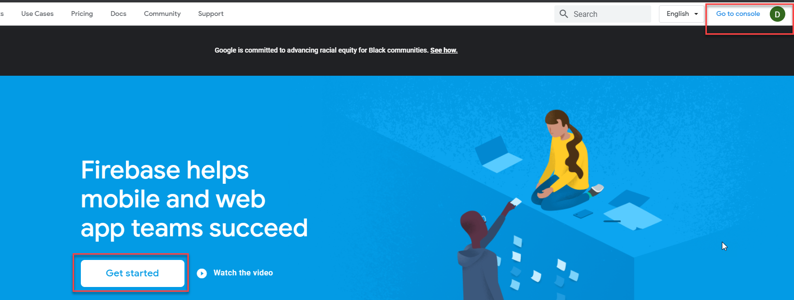

Tạo một project trùng với tên của dự án mình đang chạy ở đây tôi dùng là `REACTNATIVETRAINNER` xóa bỏ các ký tự đặc biệt từ `REACT_NATIVE_TRAINNER`

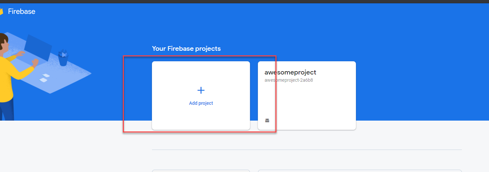

Chọn một tài khoản Analytics

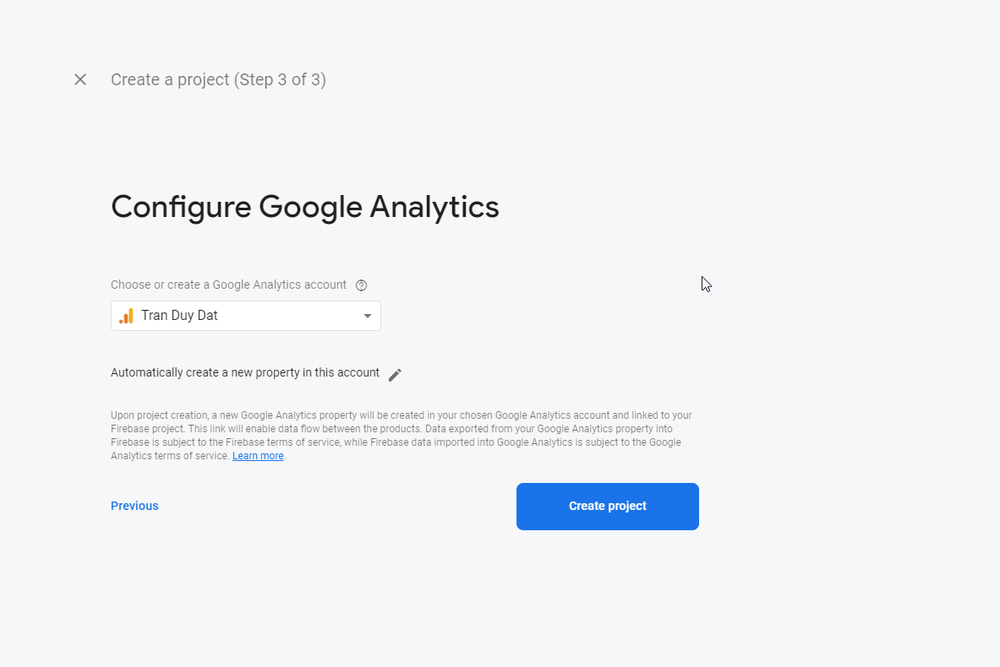

chờ một chút

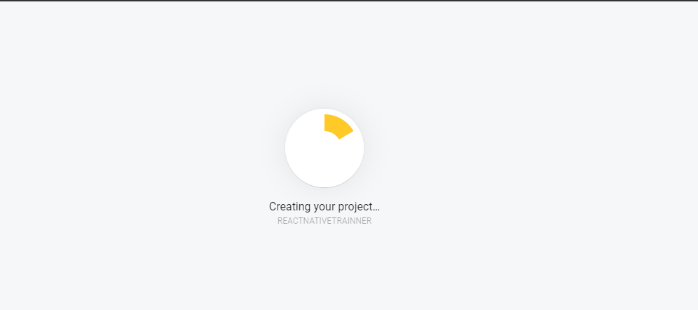

Click vào biểu tượng android

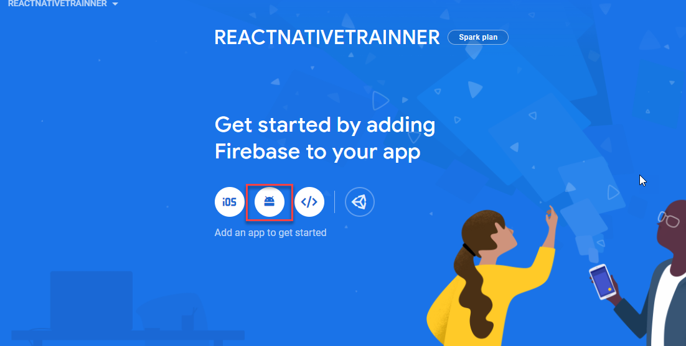

Sau đó điền đầy đủ thông tin theo hướng dẫn và theo ảnh
android packages name lấy theo packages name trong file `android/app/AndroidManifest.xml`
như ảnh bên dưới còn Application name ta dùng tên dự án hoặc tự đặt

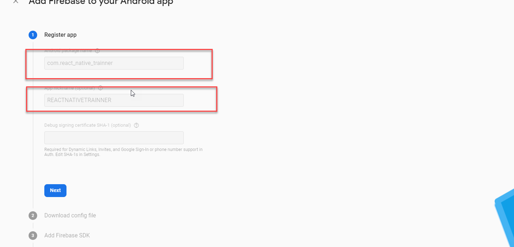

lấy packages names ở đây

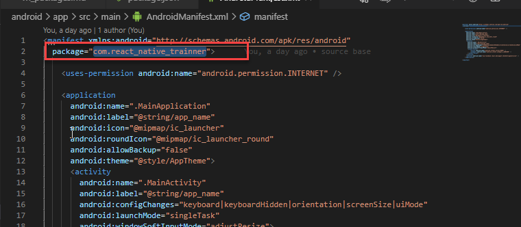

xong download file `google-services.json` và past vào `android/app`

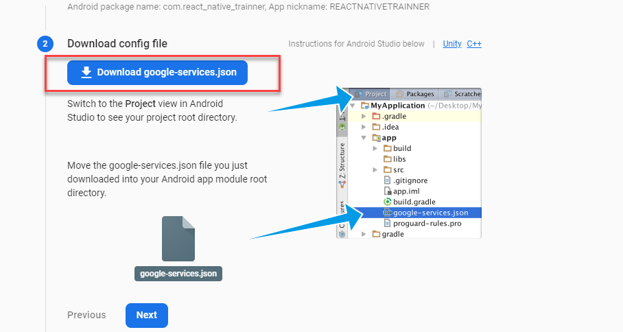
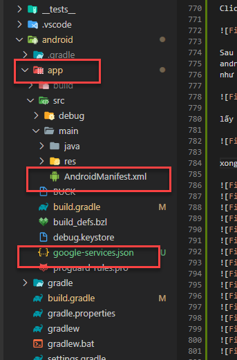

ta vào tiếp `android/build.gradle` paste `classpath 'com.google.gms:google-services:4.3.3'` vào `dependencies:` như ảnh

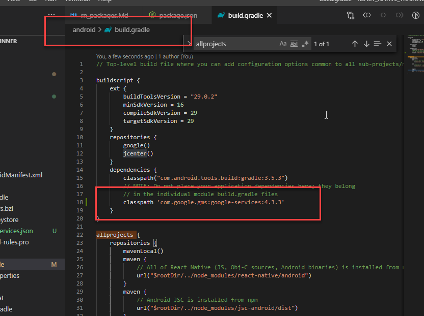

tiếp tục vào `android/app/build.gradle` paste `implementation 'com.google.firebase:firebase-analytics:17.5.0'` vào `dependencies`

add `apply plugin: "com.android.application"`
`apply plugin: 'com.google.gms.google-services'` vào đầu của file `android/app/build.gradle` nếu chưa có như ảnh

chạy `cd android && ./gradlew signingReport` để lấy được key SHA-1 nếu cần.

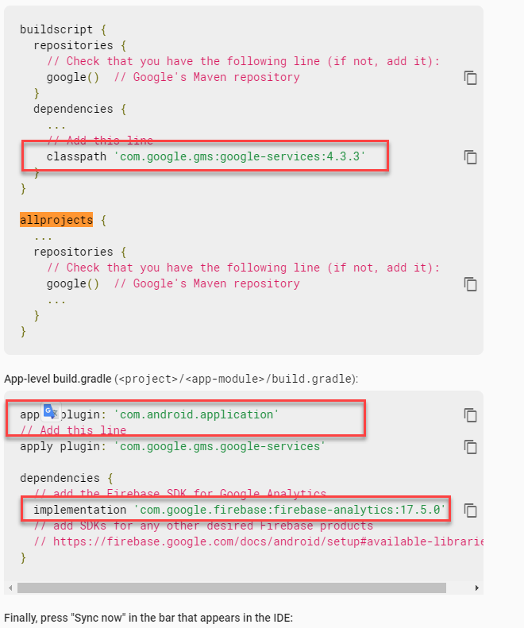

xong nhấn `next`

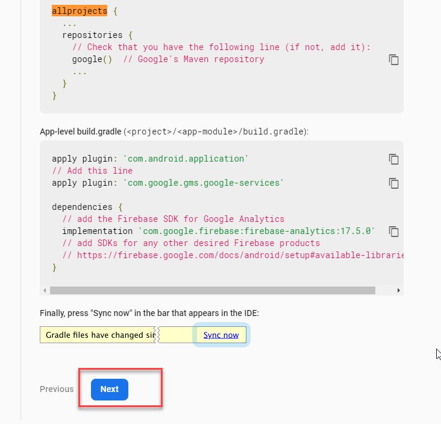

chờ một chút rồi nhấn `skip this step`

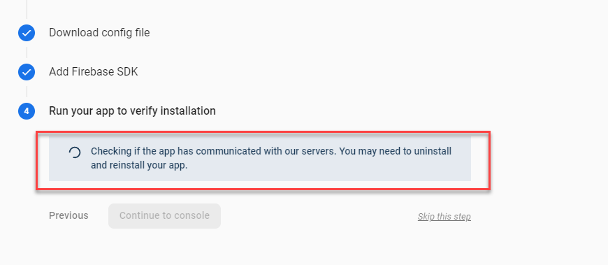

[source document react native firebae https://rnfirebase.io/messaging/server-integration](https://rnfirebase.io/messaging/server-integration)

Thêm đoạn code sau để lấy được id của devices đang dùng

```javascript
import React, {useEffect} from 'react';
import Router from '@navigator';
import messaging from '@react-native-firebase/messaging';

const App = () => {
  useEffect(() => {
    // Get the device token
    messaging()
      .getToken()
      .then((token) => {
        console.log('token', token);
      });
  });

  return (
    <>
      <Router />
    </>
  );
};

export default App;
```

sau khi lây được token ta nên trang [https://console.firebase.google.com/](https://console.firebase.google.com/)

vào project vừa tạo

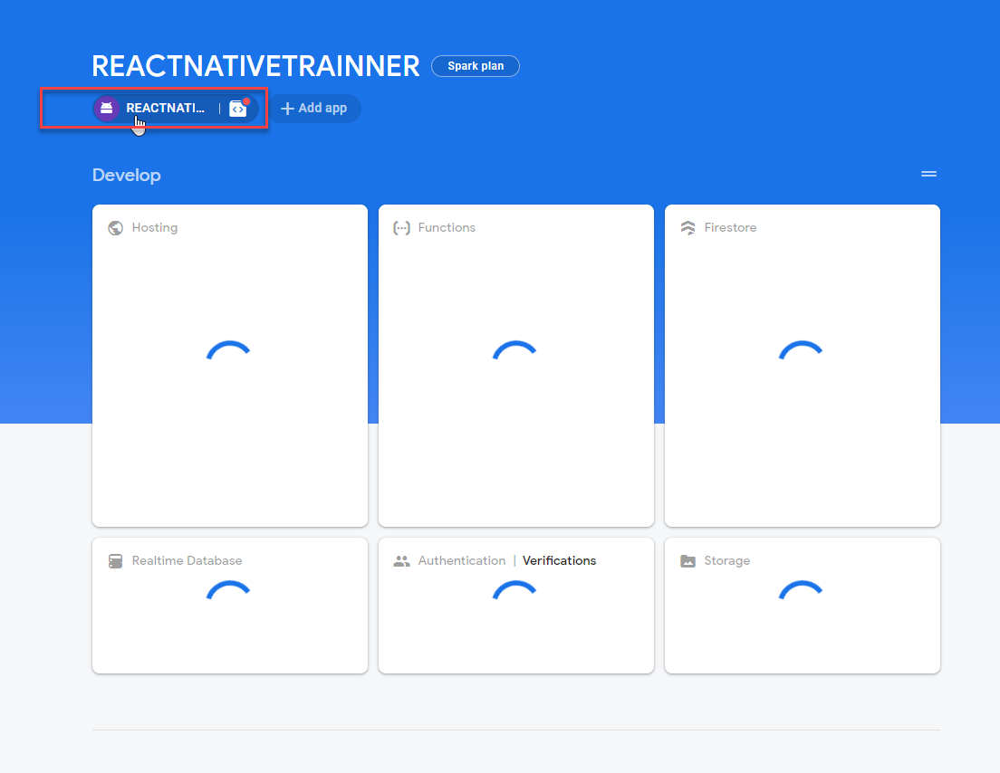

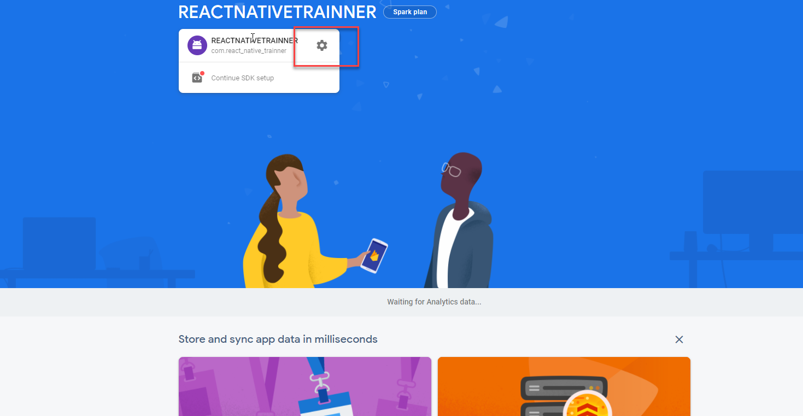

vào cloud mesageing

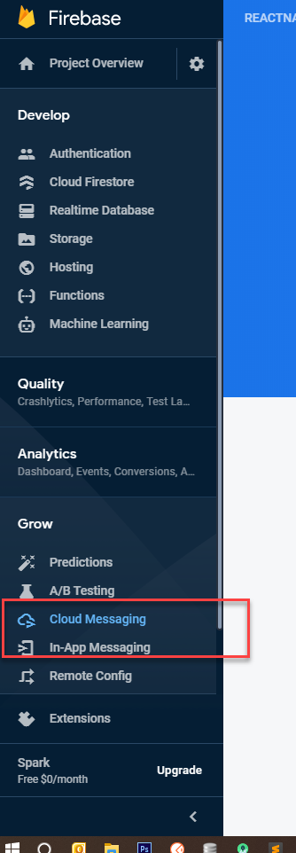

send first message


điền nội dung vào form và click vào `send test message`

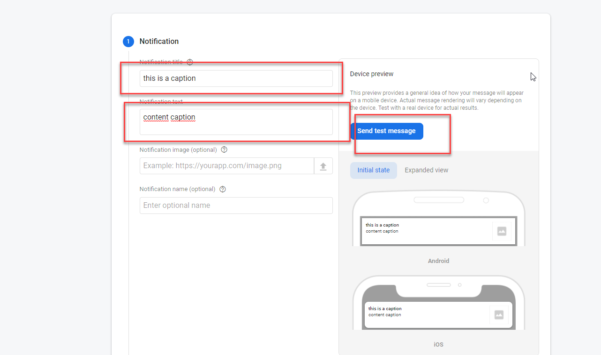

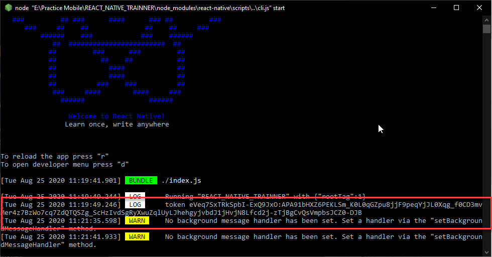

Xong điền token mà đã lấy ở trên xong tick vào ô vuông bên cạnh xong Click vào Test ta sẽ nhận được kết quả sau:

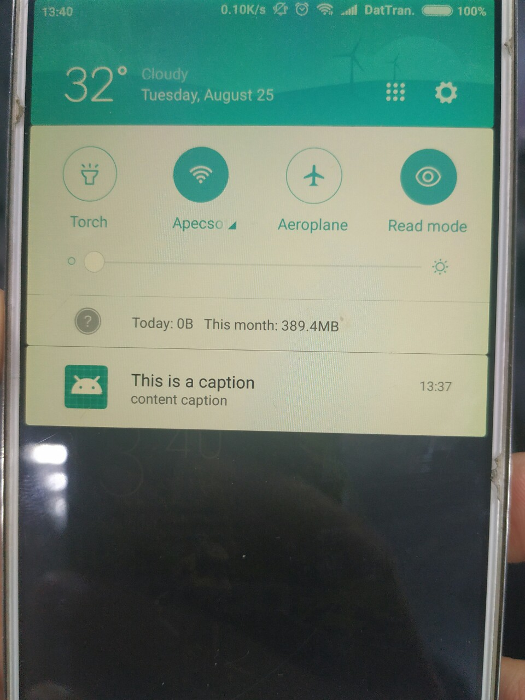

## [6.Splash screen]()

---

install:

Run `npm i react-native-splash-screen --save`

Second step(Plugin Installation):

Khi react native < 5.9 ta mới cần auto link hiện bản mới nhất là 6.3 nên chỉ cần cài đặt bình thường

Automatic installation
`react-native link react-native-splash-screen` or `npm link react-native-splash-screen`

**_Android:_**

Cài đặt file `MainActivity.java` để dùng react-native-splash-screen với những thay đổi bên cạch có comment:

```javascript
import android.os.Bundle; // here
import com.facebook.react.ReactActivity;
// react-native-splash-screen >= 0.3.1
import org.devio.rn.splashscreen.SplashScreen; // here
// react-native-splash-screen < 0.3.1
import com.cboy.rn.splashscreen.SplashScreen; // here

public class MainActivity extends ReactActivity {
   @Override
    protected void onCreate(Bundle savedInstanceState) {
        SplashScreen.show(this);  // here
        super.onCreate(savedInstanceState);
    }
    // ...other code
}
```

Tao file tên là `launch_screen.xml` theo đường link `app/src/main/res/layout` (Tạo foulder nếu không tồn tại). Sau đó paste nội dung bên dưới vào file đã tạo.

```javascript
<?xml version="1.0" encoding="utf-8"?>

<RelativeLayout xmlns:android="http://schemas.android.com/apk/res/android"
    android:orientation="vertical" android:layout_width="match_parent"
    android:layout_height="match_parent">
<ImageView android:layout_width="match_parent" android:layout_height="match_parent" android:src="@drawable/bg_splash" android:orientation="vertical" />
</RelativeLayout>
```

Sau đó tạo file `bg_splash.png` đã chuẩn bị trước từ design - sau đó paste ảnh đó paste vào tất cả các foulder drawable-... .

```
drawable-ldpi
drawable-mdpi
drawable-hdpi
drawable-xhdpi
drawable-xxhdpi
drawable-xxxhdpi
```

Thêm vào màu `color` với tên là `primary_dark` trong `app/src/main/res/values/colors.xml`

```javascript
<?xml version="1.0" encoding="utf-8"?>
<resources>
    <color name="primary_dark">#000000</color>
</resources>
```

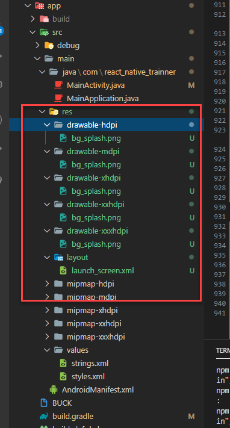

Sau đó ta có danh sách thư mục như hình trên với mỗi foulder đều có một ảnh splash

Ví dụ:


Xong khi ta vào app sẽ có kết quả như sau:

> Nếu mà app bị lỗi sau: `Task :app:mergeDexDebug FAILED` thì ta vào linh [này](https://rnfirebase.io/enabling-multidex) để làm theo hướng dẫn. hoặc vào `https://rnfirebase.io/` và search `app:mergeDexDebug FAILED` để fix.

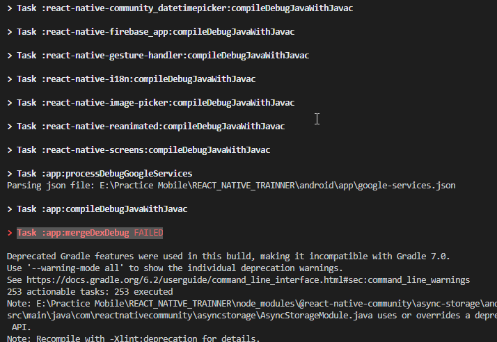

click vào `Enabling Multidex`.

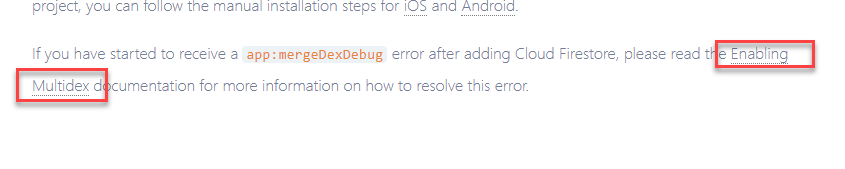

Sau đó mở file `/android/app/build.gradle` trong bộ source. tìm đến phần `defaultConfig` thêm câu lệnh `multiDexEnabled true // <-- ADD THIS in the defaultConfig sectino` như dưới ví dụ. và dự án sẽ chạy được:

```javascript
android {
    defaultConfig {
        // ...
        multiDexEnabled true // <-- ADD THIS in the defaultConfig sectino
    }
    // ...
}

dependencies {
  implementation 'androidx.multidex:multidex:2.0.1'  // <-- ADD THIS DEPENDENCY
}
```

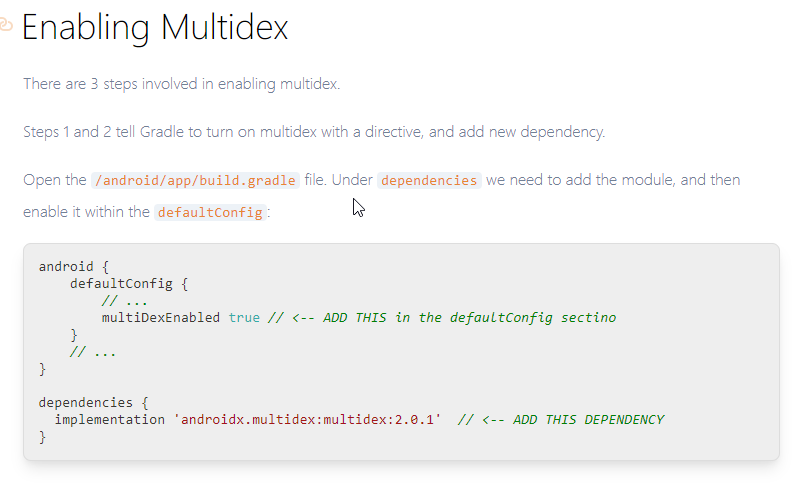

sau đó chạy nên sẽ được như sau:

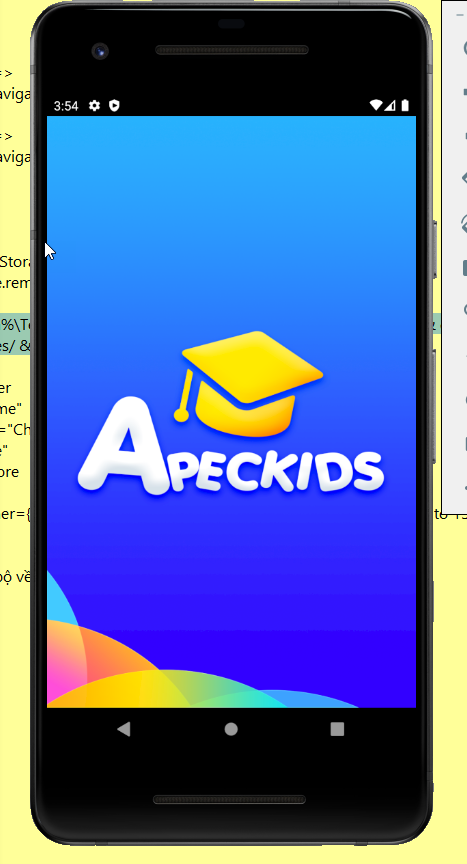

Và khi muốn tắt tắt splash screen ta dùng như sau:

```javascript
import SplashScreen from 'react-native-splash-screen';

export default class WelcomePage extends Component {
  componentDidMount() {
    // do stuff while splash screen is shown
    // After having done stuff (such as async tasks) hide the splash screen
    SplashScreen.hide();
  }
}
```

[document source: https://www.luehangs.site/lue_hang/blogs/Configure%20Launch%20Screens%20or%20Splash%20Screens%20for%20React%20Native%20Apps](https://www.luehangs.site/lue_hang/blogs/Configure%20Launch%20Screens%20or%20Splash%20Screens%20for%20React%20Native%20Apps)

# [7.react-native-skeleton-placeholder](https://github.com/chramos/react-native-skeleton-placeholder#readme)

---

cài đặt :

`npm install react-native-linear-gradient --save`

or

`yarn add react-native-linear-gradient`

Có 2 cách để sử dụng với SkeletonPlacehoder.Item

Example:

```javascript
import React from 'react';
import {View} from 'react-native';
import SkeletonPlaceholder from 'react-native-skeleton-placeholder';

const App = () => {
  return (
    <SkeletonPlaceholder>
      <SkeletonPlaceholder.Item flexDirection="row" alignItems="center">
        <SkeletonPlaceholder.Item width={60} height={60} borderRadius={50} />
        <SkeletonPlaceholder.Item marginLeft={20}>
          <SkeletonPlaceholder.Item width={120} height={20} borderRadius={4} />
          <SkeletonPlaceholder.Item
            marginTop={6}
            width={80}
            height={20}
            borderRadius={4}
          />
        </SkeletonPlaceholder.Item>
      </SkeletonPlaceholder.Item>
    </SkeletonPlaceholder>
  );
};
```

hoặc với `View`

```javascript
import React from 'react';
import {View} from 'react-native';
import SkeletonPlaceholder from 'react-native-skeleton-placeholder';

const App = () => {
  return (
    <SkeletonPlaceholder>
      <View style={{flexDirection: 'row', alignItems: 'center'}}>
        <View style={{width: 60, height: 60, borderRadius: 50}} />
        <View style={{marginLeft: 20}}>
          <View style={{width: 120, height: 20, borderRadius: 4}} />
          <View
            style={{marginTop: 6, width: 80, height: 20, borderRadius: 4}}
          />
        </View>
      </View>
    </SkeletonPlaceholder>
  );
};
```

**_Props:_**

- `backgroundColor:` xác định màu của plachoder. default: ‘#E1E9EE’
- `highlightColor:` xác định màu nổi bật của plachoder. default: ‘#f2f8fc
- `speed:` tốc độ của hiệu ứng tính bằng mili giây. default:800

# [8.Axios](https://github.com/axios/axios)

---

cài đặt:

`npm install axios`

or

`yarn add axios`

Phương thức get

```javascript
import axios from ‘axios’;
// Make a request for a user with a given ID
axios.get('/user?ID=12345')
.then(function (response) {
  // handle success
  console.log(response);
})
.catch(function (error) {
  // handle error
  console.log(error);
})
.then(function () {
  // always executed
});
```

```javascript
// Optionally the request above could also be done as
axios
  .get('/user', {
    params: {
      ID: 12345,
    },
  })
  .then(function (response) {
    console.log(response);
  })
  .catch(function (error) {
    console.log(error);
  })
  .then(function () {
    // always executed
  });

// Want to use async/await? Add the `async` keyword to your outer function/method.
async function getUser() {
  try {
    const response = await axios.get('/user?ID=12345');
    console.log(response);
  } catch (error) {
    console.error(error);
  }
}
```

Phương thức post

```javascript
axios
  .post('/user', {
    firstName: 'Fred',
    lastName: 'Flintstone',
  })
  .then(function (response) {
    console.log(response);
  })
  .catch(function (error) {
    console.log(error);
  });
```

Thực hiện nhiều yêu cầu

```javascript
function getUserAccount() {
  return axios.get('/user/12345');
}

function getUserPermissions() {
  return axios.get('/user/12345/permissions');
}

Promise.all([getUserAccount(), getUserPermissions()]).then(function (results) {
  const acct = results[0];
  const perm = results[1];
});
```

# [9.react-native-image-picker](https://github.com/react-native-community/react-native-image-picker)

---

# [10.]()

---

# một vài packages khác hay dùng

- react-native-keyboard-aware-scroll-view
- react-native-simple-toast
- react-native-i18n
- @react-native-community/datetimepicker
